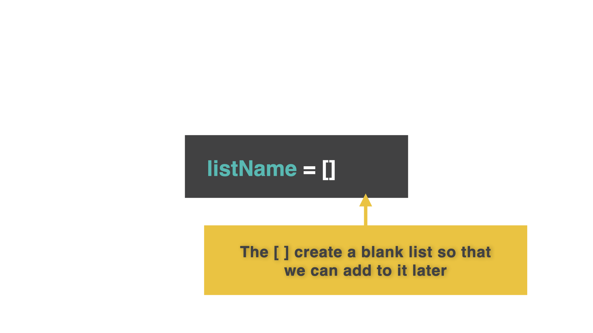
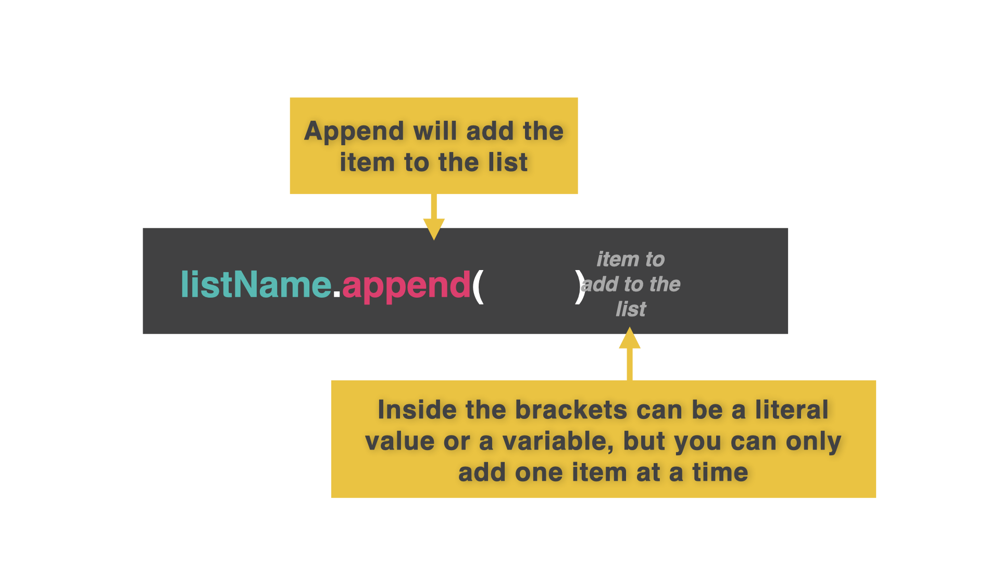

# Dynamic Lists

**Dynamic lists** are ways of using a blank list and adding or removing items to it as we go.

## Blank lists
👉 Let's make an agenda for today. I am not going to put anything in this list (yet). Behind the scenes, the computer is going to recognize this code as a blank list.

```python
myAgenda = []
```



## Append a list
`.append` will let us add whatever is in `()` to the list. 




👉 Let's use a `while True` loop to add items to the list. We will store this in a variable called `item`. Add this code to the end of the code above:

```python
while True:
  item = input("What's next on the Agenda?: ")
  myAgenda.append(item)
  printList()
  ```
👉 What is next on your agenda? Type it in the console. 

## Printing our new list
👉 Wait?! Why can't we see what we just added to the list? We need to `print` the list each time to see what has changed. Let's use a subroutine (why not!):

```python
myAgenda = []

def printList():
  print() #this is just to add an extra space between items
  for item in myAgenda:
    print(item)
  print() #this is just to add an extra space between items

while True:
  item = input("What's next on the Agenda?: ")
  myAgenda.append(item)
  printList()
```
```python
#The comments in green are for you and the computer will skip them.
```

Do you see how the subroutine allows you to add a new item to your agenda and prints the entire list each time?

You could even import `os` and `sleep` libraries to pause and clear your code to make this dyanmic list look even nicer.

*Remember: The list that's blank needs to be listed first...even before the subroutines.*

### Try it for yourself!