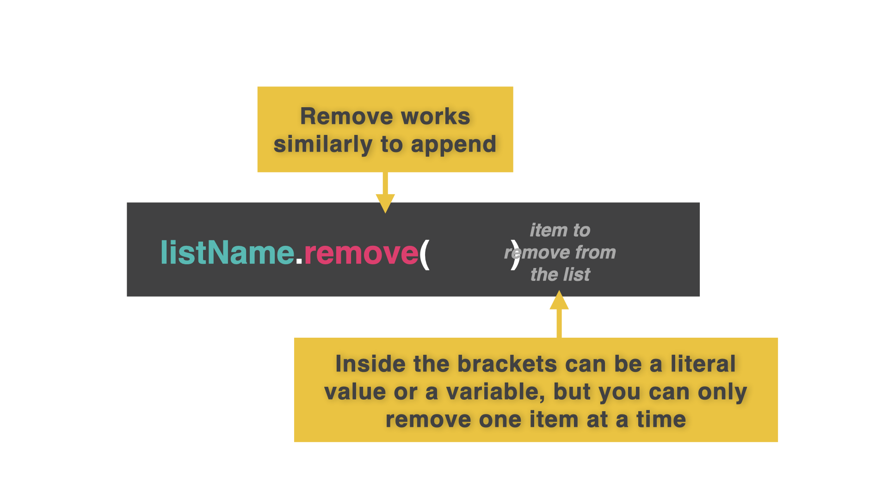

# Removing Items from a List

👉 Let's make a few changes to our list. We want to ask the user if they want to add or remove an item from their list:

```python
myAgenda = []

def printList():
  print() 
  for item in myAgenda:
    print(item)
  print() 

while True:
  menu = input("add or remove?: ")
  if menu == "add":
    item = input("What's next on the Agenda?: ")
    myAgenda.append(item)
  elif menu == "remove":
    item = input("What do you want to remove?: ")
    myAgenda.remove(item)
  printList()
```
Notice how using `.remove` will remove what is inside the `( )`.



### You just build a pretty comprehensive program. Go you!